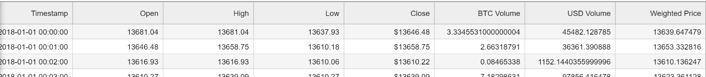
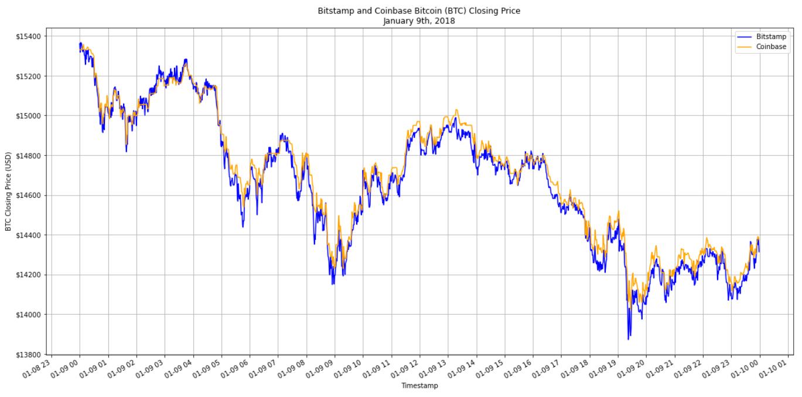
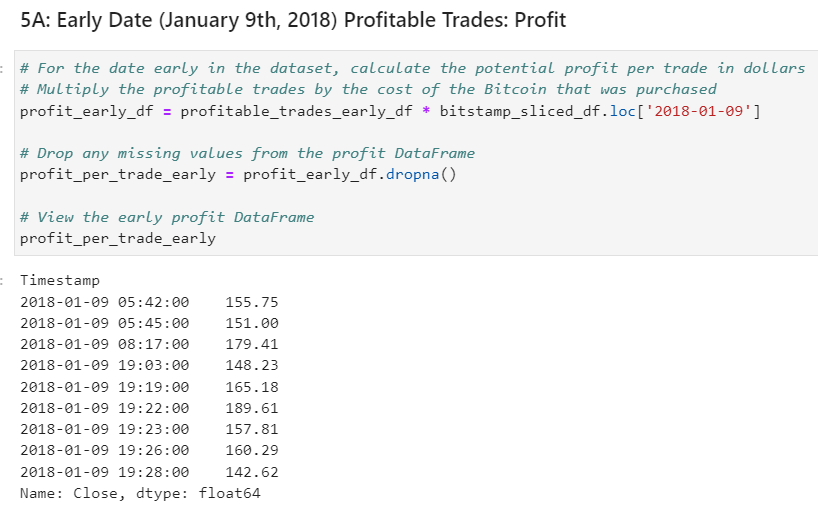
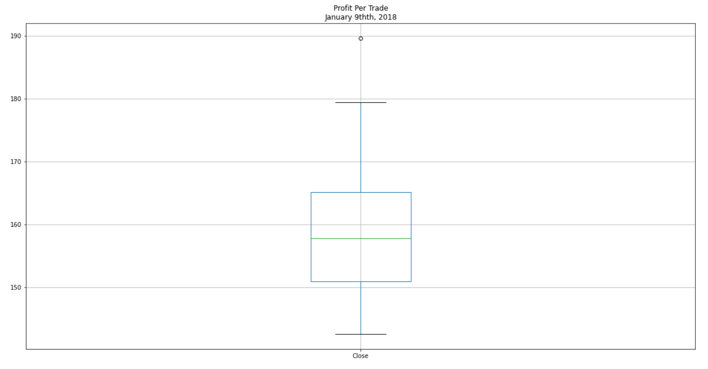
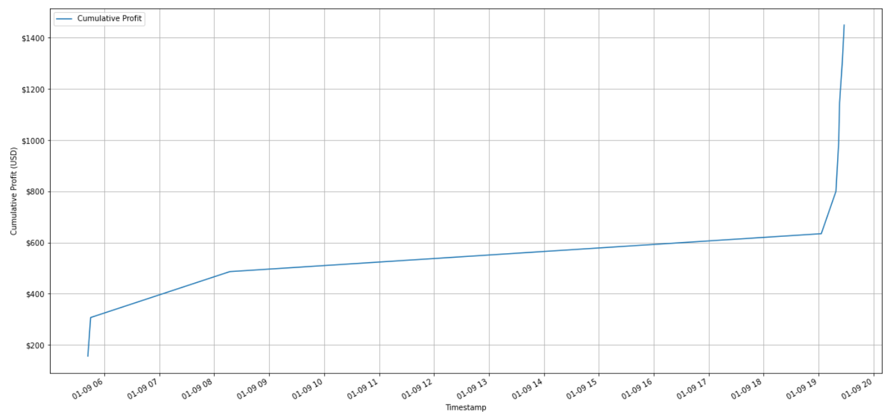

# Fintech Arbitrage Analyzer

The Fintech Arbitrage Analyzer is a Python-based Jupyter notebook that compares Bitcoin closing prices across Bitstamp and Coinbase exchanges over select time periods in 2018. The analyzer works by importing closing Bitcoin prices from Comma Separated Values (CSV) files from each exchange; preparing the data for analysis by removing empty rows and formatting data; calculating arbitration spreads and their profits; and plotting various dataframes to gain insights on trends over time.  

## Refactoring Opportunities

This notebook is a fit-for-purpose tool for analyzing specifically Bitcoin closing prices on Bitstamp and Coinbase exchanges during the first quarter of 2018. However, with a bit of simple refactoring the code can be made to accept any two CSV files for any cryptocurrency over any timeframe.  The following TODOs exist:

- Add configuration file that contains settings that control resources (files and their location and names), dataset reading (index column names and closing price names), and visualization (chart preferences, labeling, etc.)
- Refactor Jupyter cells to use configuration and generify variable names
- Modularize visualization so plotting code isn't repeated. 

## Technologies

The application uses the following technologies:

- Python 3.7
- [pandas](https://pandas.pydata.org/pandas-docs/stable/index.html)
- [Jupyter Lab](https://jupyter.org/)

## Installation Guide

```python

pip install numpy
pip install pandas
pip install matplotlib

```
### Jupyter

The application is based on a Jupyter Notebook. The minimum required is a Jupyter Notebook but Jupyter Lab can be installed as well.  Please review the [Jupyter installation instructions](https://jupyter.org/install)


## Usage

### Startup

- Launch Jupyter
- Load **crypto_arbitrage.ipynb** and select **Run => Restart Kernal and Run all Cells** from the menu

### Input Example

Two Comma Separated Values (.CSV) files are required (one from each exchange) that at a minimum have the timestamp and the closing price of the cryptocurrency. In the example below the two columns of interest are **Timestamp** and **Close**. The files need to cover the same cryptocurrency and cover the same time period and time granularity so that index matching can occur. 



### Output Example

The data is index-matched, analyzed, and plotted to identify arbitrage opportunities over time.  In the examples below Bitcoin Close prices between the Bitstamp and Coinbase exchanges on January 9th, 2018 were analyzed and the potential profits computed and visualized.










## Brief Analysis Review

Analyzing this dataset from January 1st - March 31st 2018 identified several arbitrage opportunities in the earlier part of the timeframe where Bitcoin was selling lower at Bitstamp than it was at Coinbase.  When analyzing the latter part of the time series arbitrage opportunities became much less frequent when buying Bitcoin from Bitstamp.  High-level analysis revealed arbitrage opportunities in this latter part where Bitstamp prices where higher than those of Coinbase, but this analysis was out of scope.


## Contributors

- Jacob Rougeau

## License

MIT